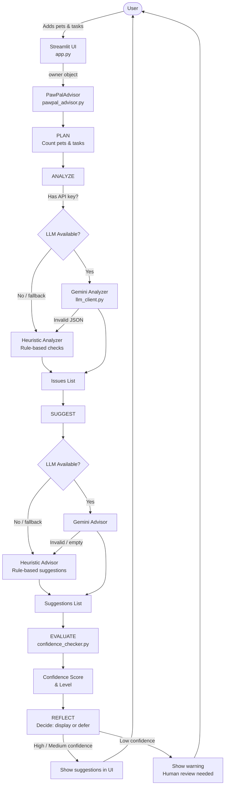

# PawPal+ AI Care Advisor

> **Applied AI System — Module 5 Final Project (AI110)**
> Base project: *PawPal+* (Module 2 Show — Smart Pet Care Management System)

PawPal+ AI Care Advisor extends the original PawPal+ scheduling tool with an **agentic AI workflow** that automatically analyzes your pets' care schedules, detects gaps, proposes targeted improvements, and evaluates confidence before presenting recommendations — all with a full heuristic fallback when no API key is available.

---

## Demo Walkthrough

> 📽️ **[Watch the demo walkthrough](https://www.loom.com/share/f0850e3b664d4e6a98e2896f3cbbf6ae)**

---

## What It Does

The original PawPal+ (Module 2) was a priority-based pet care scheduler with greedy task selection and conflict detection. It answered: *"Given these tasks, which should I do today?"*

This extension adds the AI Care Advisor, which answers a harder question: *"Is my pet's care schedule actually complete and healthy?"*

The advisor runs a five-step agentic loop:

| Step | What Happens |
|---|---|
| **PLAN** | Determine which pets and tasks to analyze |
| **ANALYZE** | Detect care gaps (missing walks, feeding, recurring meds) using heuristics or Gemini |
| **SUGGEST** | Generate specific, actionable recommendations per issue |
| **EVALUATE** | Score suggestion confidence using the reliability checker |
| **REFLECT** | Decide whether to display suggestions automatically or flag for human review |

---

## System Architecture



> **Note:** Export this diagram as a PNG using [Mermaid Live Editor](https://mermaid.live) and save as `assets/architecture.png`.

---

## Setup Instructions

### 1. Clone the repo

```bash
git clone https://github.com/OldMack/applied-ai-pawpal.git
cd applied-ai-pawpal
```

### 2. Install dependencies

```bash
pip install -r requirements.txt
```

### 3. Configure API key (optional — heuristic mode works without it)

```bash
cp .env.example .env
# Open .env and add your Gemini API key
```

### 4. Run the app

```bash
streamlit run app.py
```

---

## Sample Interactions

### Example 1 — Dog with no walks (heuristic mode)

**Input:** Owner "Sam" has a dog named Buddy with only a Feeding task.

**Detected Issues:**
- 🔴 [HIGH] Exercise Gap — Buddy: "Buddy (Dog) has no walk tasks. Dogs need daily exercise."

**Suggestions:**
- 🔴 [HIGH] Buddy: "Add two daily Walk tasks for Buddy: a 30-minute HIGH priority walk at 8:00 AM and a 30-minute walk at 6:00 PM."

**Confidence:** HIGH (score: 100) — auto-displayed.

---

### Example 2 — Cat missing feeding (heuristic mode)

**Input:** Owner "Riley" has a cat named Luna with only an Enrichment/Playtime task.

**Detected Issues:**
- 🔴 [HIGH] Feeding Gap — Luna: "Luna has no feeding tasks scheduled."

**Suggestions:**
- 🔴 [HIGH] Luna: "Add HIGH priority Feeding tasks for Luna: breakfast at 7:00 AM (15 min) and dinner at 5:00 PM (15 min)."

**Confidence:** HIGH (score: 100) — auto-displayed.

---

### Example 3 — Complete schedule, no issues

**Input:** Owner "Jordan" has a dog with two walks and a feeding task.

**Detected Issues:** None.

**Suggestions:** None — "No care gaps detected — your pets' schedules look complete!"

**Confidence:** N/A (no suggestions generated — correct behavior).

---

## Design Decisions

**Agentic workflow over a single AI call.** Rather than sending the full schedule to Gemini and trusting its output blindly, the system uses a five-step loop with explicit logging at each step. This makes the decision trail auditable and allows targeted fallbacks.

**Heuristic fallback at every LLM boundary.** If Gemini returns malformed JSON, an empty string, or an error, the agent immediately switches to deterministic rules. This means the advisor works fully offline and never silently fails.

**Confidence checker as a separate layer.** The `check_confidence` function is intentionally decoupled from the advisor. It can be updated independently, unit-tested in isolation, and extended with new guardrails without changing the agent logic.

**Validation before display.** Suggestions that reference unknown pet names (possible hallucinations) are penalized proportionally. If all suggestions are hallucinated, the confidence drops below the display threshold and the user sees a warning instead of incorrect advice.

---

## Testing Summary

```
29 tests passed, 0 failed.
```

| Test class | What it covers |
|---|---|
| `TestAdvisorOfflineMode` | Core heuristic analysis: no tasks, missing walks, missing feeding, non-recurring meds, complete schedules |
| `TestAdvisorMockClientFallback` | LLM returns non-JSON → agent falls back to heuristics + still produces suggestions |
| `TestConfidenceChecker` | Empty suggestions, valid suggestions, hallucinated pet names, all-hallucinated guardrail |
| `TestTask / TestPet / TestOwner / TestPawPalSystem` | Original PawPal+ core functionality (15 tests, unchanged) |

**Key finding:** The `test_guardrail_blocks_display_when_many_unknown_pets` test caught a real bug — a flat −30 penalty was not enough to block display when all suggestions were hallucinated. The fix scaled the penalty proportionally to the hallucination rate.

**What didn't work:** The heuristic analyzer does not detect enrichment gaps for non-dog species. Gemini mode catches these. Future work: extend heuristic rules to cover cats and birds more thoroughly.

---

## Reflection and Ethics

**Limitations and biases:** The heuristic rules are biased toward dogs (walk frequency checks). Cats, birds, and exotic pets get fewer automated checks. The system also does not account for pet age — senior pets may need different care cadences.

**Misuse potential:** A user could treat the advisor's suggestions as a substitute for veterinary advice. The system displays suggestions but does not claim medical authority. A future guardrail could add a disclaimer when medication-related issues are detected.

**Surprising reliability result:** The confidence checker's hallucination penalty was initially too weak — a test caught that two hallucinated pet names still yielded a passing confidence score. The proportional scaling fix was not obvious until the test failed.

**AI collaboration:**
- *Helpful:* Copilot suggested the bracket-matching approach in `_extract_first_json_array` for robust JSON parsing when models wrap responses in extra prose.
- *Incorrect:* Copilot suggested `response.candidates[0].content.parts[0].text` for the Gemini SDK — this raises an `AttributeError`. The correct attribute is `response.text`.

---

## File Structure

```
applied-ai-pawpal/
├── app.py                        # Streamlit UI (extended with AI Advisor section)
├── pawpal_system.py              # Core OOP: Owner, Pet, Task, PawPalSystem
├── pawpal_advisor.py             # Agentic AI care advisor (NEW)
├── llm_client.py                 # GeminiClient + MockClient (NEW)
├── reliability/
│   ├── __init__.py
│   └── confidence_checker.py    # Confidence scoring guardrail (NEW)
├── prompts/
│   ├── analyzer_system.txt       # LLM analyzer system prompt (NEW)
│   ├── analyzer_user.txt         # LLM analyzer user prompt (NEW)
│   ├── advisor_system.txt        # LLM advisor system prompt (NEW)
│   └── advisor_user.txt          # LLM advisor user prompt (NEW)
├── tests/
│   ├── __init__.py
│   └── test_advisor.py          # Advisor + confidence checker tests (NEW)
├── test_pawpal.py                # Original PawPal+ tests
├── assets/
│   └── architecture.png         # System diagram (export from Mermaid above)
├── requirements.txt
├── .env.example
└── model_card.md
```
